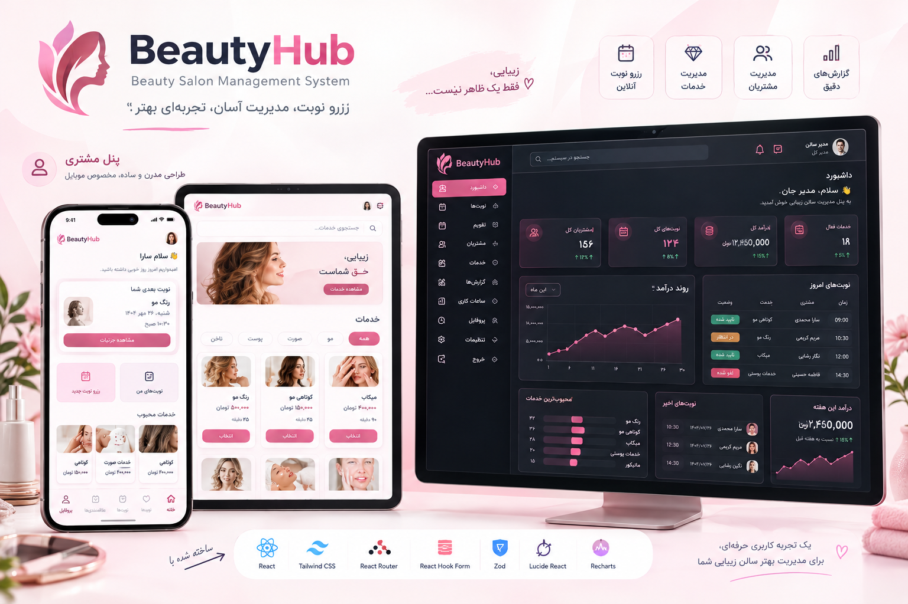

# 💇‍♀️ BeautyHub — Beauty Salon Management System

A full front-end **booking & management system** for a single-branch beauty salon, built as a real-world portfolio project with React and Tailwind CSS.

Customers can browse services, book appointments, reschedule or cancel them, and manage their profile — all in a **mobile-first, RTL, Persian UI**. Salon owners get a full **desktop-first admin panel** to manage appointments, a weekly/daily calendar, customers, services (CRUD), working hours, and revenue reports.

> 🇮🇷 The product UI is entirely in **Persian (Farsi)** and built **RTL-first**, including a Jalali (Persian) calendar for all date logic. This README is in English for a wider audience.

<p align="center">
  
</p>

---

✨ Features

### For Customers (mobile-first)
- 🔐 Authentication (login / register) with role-based redirect
- 🏠 Personalized dashboard with next appointment, quick actions & popular services
- 💈 Browse services with search & category filters
- 📅 Multi-step booking flow — select service → date → time → confirm — with real-time slot availability
- 🗓️ Appointment management — upcoming / completed / cancelled tabs
- 🔁 Reschedule and ❌ cancel appointments with confirmation dialogs
- 👤 Profile management (personal info, password, logout)
- 📱 Bottom navigation — native app-like mobile UX

### For Admin / Salon Owner (desktop-first)
- 📊 Dashboard — total appointments, customers, revenue & services at a glance, with a revenue chart
- 📋 Appointment management — search, filter, confirm / complete / cancel
- 🗓️ Weekly & daily calendar view of all appointments
- 👥 Customer directory with booking history per customer
- 🛠️ Full CRUD for services (name, price, duration, category, image, status)
- 🕒 Working hours configuration (per weekday, open/closed)
- 📈 Reports — revenue, completed/cancelled counts, date-range filters
- ⚙️ Account settings — profile info & password change
- 🧭 Responsive, collapsible sidebar (drawer on mobile/tablet)

### Cross-cutting
- ⏱️ Conflict-free time-slot engine — respects service duration, working hours & existing bookings
- 🗓️ Full Jalali (Persian) calendar support via `dayjs` + `jalaliday`
- 🎨 Centralized design-token system (Tailwind v4 `@theme`) — brand color, status colors, typography
- 🧩 Clear separation between UI and data (`services/` layer) — ready to swap mock data for a real API
- ✅ Loading / empty / error / success states handled throughout
- 🛡️ Role-based route guards (`ProtectedRoute` / `GuestRoute`)

---

## 🧱 Tech Stack

| Layer            | Choice                                      |
|-------------------|----------------------------------------------|
| Framework         | [React 19](https://react.dev/)               |
| Build tool        | [Vite 6](https://vite.dev/)                   |
| Styling           | [Tailwind CSS v4](https://tailwindcss.com/)   |
| Routing           | [React Router v7](https://reactrouter.com/)   |
| Forms             | [React Hook Form](https://react-hook-form.com/) + [Zod](https://zod.dev/) |
| Charts            | [Recharts](https://recharts.org/)             |
| Icons             | [lucide-react](https://lucide.dev/)           |
| Dates (Jalali)    | [dayjs](https://day.js.org/) + [jalaliday](https://www.npmjs.com/package/jalaliday) |
| Data layer        | Mock data + a thin `services/` abstraction (swap-ready for a real API) |

> No backend yet — this is a **frontend-only** project by design. See [Roadmap](#-roadmap--v2).

---

## 📂 Project Structure

```
src/
├── Components/
│   ├── Layouts/            # CustomerLayout, AdminLayout, AuthLayout
│   ├── common/              # Shared feature-agnostic components (Sidebar, ScheduleSteps, etc.)
│   └── ui/                  # Generic UI primitives (Modal, ConfirmDialog, StatCard, ...)
│
├── features/
│   ├── auth/                 # Login / Register
│   ├── customer/              # Dashboard, Services, Booking, Appointments, Profile
│   └── admin/                 # Dashboard, Appointments, Calendar, Customers, Services, Reports, Settings
│
├── context/                 # AuthContext (session, role, auth actions)
├── services/                 # Data-access layer (mock today, real API tomorrow)
├── data/mock/                # Mock datasets (users, services, appointments, working hours...)
├── constants/                # Shared enums & lookup tables
├── utils/                     # Pure helper functions (currency formatting, time-slot engine...)
├── lib/                       # dayjs config, router definition
└── index.css                  # Tailwind import + design tokens (@theme)
```

---

## 🚀 Getting Started

### Prerequisites
- Node.js 18+
- npm

### Installation

```bash
git clone https://github.com/<your-username>/BeautyHub-Management-System.git
cd BeautyHub-Management-System
npm install
```

### Development

```bash
npm run dev
```

The app will be available at `http://localhost:5173`.

### Build

```bash
npm run build
npm run preview
```

### Test credentials (mock auth)

| Role     | Phone / Email                              | Password   |
|----------|---------------------------------------------|------------|
| Customer | `09054273179` or `sara@example.com`         | `123456`   |
| Admin    | `09173562535` or `admin@beautyhub.com`      | `123321` |

> Session is persisted in `localStorage`; data lives in-memory (mock), so it resets on a hard refresh of the dataset only when the module reloads — not on every navigation.

---

## 🗺️ Roadmap / V2

Deliberately **out of scope** for this MVP, to keep the project focused:

- 💳 Online payment
- 📩 SMS / email notifications
- ⭐ Reviews & ratings
- 🎁 Loyalty program
- 👩‍💼 Multiple staff / stylists
- 🏢 Multi-branch support
- 📦 Inventory management
- 💰 Payroll
- 📊 Advanced analytics
- 🔌 Real backend & API integration

---

## 📸 Adding Screenshots

1. Run the app locally and capture screenshots (phone-width for customer screens, desktop-width for admin screens).
2. Drop the images into `docs/screenshots/` using these names (or update the paths at the top of this file):
   - `customer-dashboard.png`
   - `booking-flow.png`
   - `admin-dashboard.png`
3. Commit and push — they'll render automatically on the GitHub repo page.

---

## 📄 License

This project is open-source and available for learning/portfolio purposes. Add a license of your choice (e.g. MIT) if you plan to share the source publicly.

---

## 🙋 Author

Built as a personal portfolio project — feedback and suggestions are welcome via Issues or Pull Requests.
